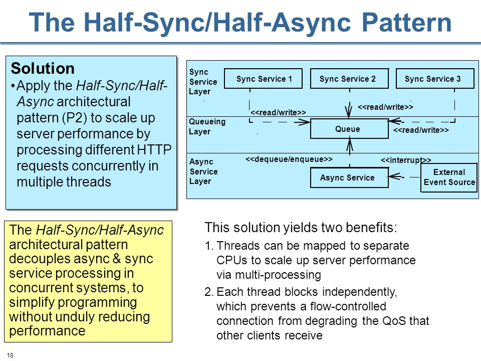

# Concurrency Pattern

## Overview

**Concurrency patterns** are those types of **design patterns** that deal with the multi-threaded programming paradigm.

Examples of this class of patterns include:

- Active Object
- Balking pattern
- Barrier
- Double-checked locking
- Guarded suspension
- Leaders/followers pattern
- Monitor Object
- Reactor pattern
- Read write lock pattern
- Scheduler pattern
- Thread pool pattern
- Thread-local storage

> https://en.wikipedia.org/wiki/Concurrency_pattern

> http://www.cs.wustl.edu/~schmidt/patterns-ace.html

The choice of concurrency architecture has a significant impact on the design and performance of multi-threaded networking middleware and applications. No single concurrency architecture is suitable for all workload conditions and hardware and software platforms. The patterns below therefore collectively provide solutions to a variety of concurrency problems.

The first two patterns specify designs for sharing resources among multiple threads or processes:

- The *Active Object* design pattern decouples method execution from method invocation. Its purpose is to enhance concurrency and simplify synchronized access to objects that reside in their own threads of control
- The *Monitor Object* design pattern synchronizes concurrent method execution to ensure that only one method at a time runs within an object. It also allows an object's methods to schedule their execution sequences cooperatively.

Both patterns can synchronize and schedule methods invoked concurrently on objects. The main difference is that an active object executes its methods in a different thread than its clients, whereas a monitor object executes its methods by borrowing the thread of its clients. As a result active objects can perform more sophisticated--albeit expensive--scheduling to determine the order in which their methods execute.

The next two patterns define higher-level concurrency architectures:

- The *Half-Sync/Half-Async* architectural pattern decouples asynchronous and synchronous processing in concurrent systems, to simplify programming without reducing performance undudly. This pattern introduces two intercommunicating layers, one for asynchronous and one for synchronous service processing. A queuing layer mediates communication between services in the asynchronous and synchronous layers.
- The *Leader/Followers* architectural pattern provides an efficient concurrency model where multiple threads take turns to share a set of event sources to detect, demultiplex, dispatch, and process service requests that occur on the event sources. The Leader/Followers pattern can be used in lieu of the Half-Sync/Half-Async and Active Object patterns to improve performance when there are no synchronization or ordering constraints on the processing of requests by pooled threads.

Implementors of the *Half-Sync/Half-Async* and *Leader/Followers* patterns can use the *Active Object* and *Monitor Object* patterns to coordinate access to shared objects efficiently.

The final pattern offers a different strategy for addressing certain inherent complexities of concurrency:

- The *Thread-Specific Storage* design pattern allows multiple threads to use one 'logically global' access point to retrieve an object that is local to a thread, without incurring locking overhead on each access to the object. To some extent this pattern can be viewed as the 'antithesis' of the other patterns in this section, because it addresses several inherent complexities of concurrency by preventing the sharing of resources among threads.

Implementations of all patterns above can use the *Synchronization* patterns protect critical regions from concurrent access.

> https://www.dre.vanderbilt.edu/~schmidt/POSA/POSA2/conc-patterns.html

## Active Object

> http://www.cs.wustl.edu/~schmidt/PDF/Act-Obj.pdf

The *Active Object* pattern decouples the method invocation from method execution. The method invocation is made on an Active Object on client thread and method execution is performed by an independent thread asynchronously without blocking the client thread. Thus, the client thread is not tied-up until the method execution is over. After a method is invoked and the command to execute it is dispatched to the Scheduler or Dispatcher, it can perform other tasks.

The method is invoked on Active Object. An Active Object has a public interface called as Proxy. The Active Object creates a Message (Command pattern) which contains the information about the method call and puts it in the Message Queue. After the message is enqueued, the Scheduler or Dispatcher is notified to read the message. The Scheduler reads the message by dequeuing it from Message Queue. After the message is read, the Scheduler creates one or multiple threads called Servant for each method execution. The message sent by Scheduler is interpreted and executed by the Servant. The method may return a result as a Future implementation to the client.

> https://madhuraoakblog.wordpress.com/2014/05/10/active-object-pattern/

## Half Sync / Half Async

> http://www.cs.wustl.edu/~schmidt/PDF/PLoP-95.pdf

> http://slideplayer.com/slide/6898057/

It is a concurrent pattern which allow the synchronous and asynchronous processing services to communicate without complicating their programming model and degrading their performance.

In order to do this, the services in the system is decomposed into two layers: synchronous layer and asynchronous layer.

- The synchronous service layer does high level processing(by using threads/processes).
- The asynchronous service layer does low level processing. Here the layer can't block.
- There is a queuing layer that provides the mechanism for communicating between services between synchronous and asynchronous layer.
- There is an external event source that generates interrupts for asynchronous layer.

> https://www.quora.com/Concurrency-computer-science-What-is-the-half-sync-half-async-software-pattern

## Leader / Follower

> http://kircher-schwanninger.de/michael/publications/lf.pdf

The pattern consists of 4 components:

- ThreadPool
- HandleSet
- Handle
- ConcreteEventHandler (implements the EventHandler interface).

You can think of it as a taxi station at night, where all the drivers are sleeping except for one, the leader. The ThreadPool is a station managing many threads - cabs.

The leader is waiting for an IO event on the HandleSet, like how a driver waits for a client.

When a client arrives (in the form of a Handle identifying the IO event), the leader driver wakes up another driver to be the next leader and serves the request from his passenger.

While he is taking the client to the given address (calling ConcreteEventHandler and handing over Handle to it) the next leader can concurrently serve another passenger.

When a driver finishes he take his taxi back to the station and falls asleep if the station is not empty. Otherwise he become the leader.

> http://stackoverflow.com/questions/3058272/explain-leader-follower-pattern

## Reference

- https://en.wikipedia.org/wiki/Concurrency_pattern
- http://www.cs.wustl.edu/~schmidt/patterns-ace.html
- https://www.dre.vanderbilt.edu/~schmidt/POSA/POSA2/
- https://www.dre.vanderbilt.edu/~schmidt/POSA/POSA2/conc-patterns.html
- https://sudo.ch/unizh/concurrencypatterns/ConcurrencyPatterns.pdf
- http://materias.fi.uba.ar/7562/2007/POSA2.pdf
- http://www.cs.wustl.edu/~schmidt/PDF/lf.pdf
- http://www.cs.wustl.edu/~schmidt/PDF/Act-Obj.pdf
- http://www.cs.wustl.edu/~schmidt/PDF/PLoP-95.pdf
- http://www.cs.wustl.edu/~schmidt/PDF/TSS-pattern.pdf
- http://www.cs.wustl.edu/~schmidt/PDF/locking-patterns.pdf
