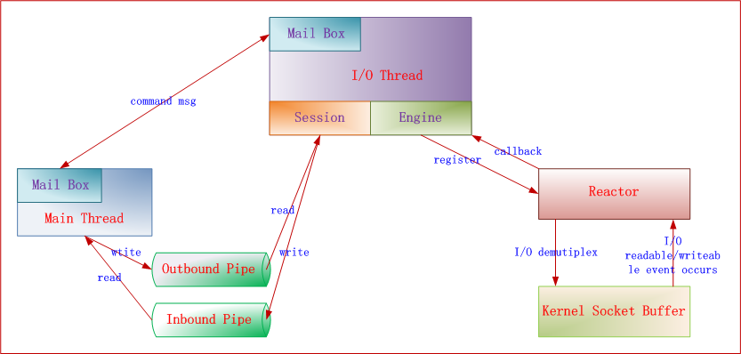
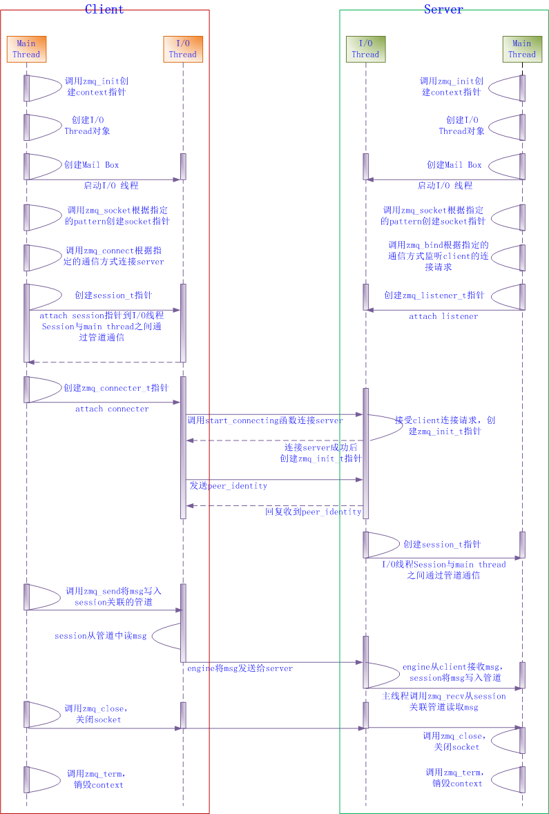
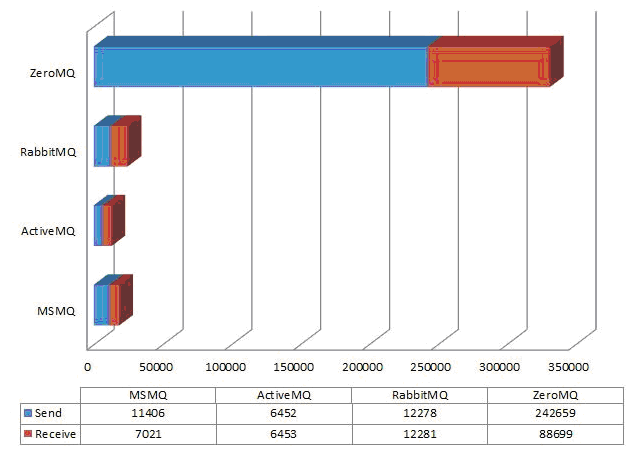

# ZeroMQ

**ZeroMQ** (also spelled **ØMQ**, **0MQ** or **ZMQ**) is a high-performance asynchronous messaging library, aimed at use in distributed or concurrent applications. It provides a message queue, but unlike message-oriented middleware, a ZeroMQ system can run without a dedicated message broker. The library's API is designed to resemble that of Berkeley sockets.

The ZeroMQ API provides sockets (a kind of generalization over the traditional IP and Unix domain sockets), each of which can represent a many-to-many connection between endpoints. Operating with a message-wise granularity, they require that a messaging pattern be used, and are particularly optimized for that kind of pattern.

The basic ZeroMQ patterns are:

- Request–reply

  Connects a set of clients to a set of services. This is a remote procedure call and task distribution pattern.

  

- Publish–subscribe

  Connects a set of publishers to a set of subscribers. This is a data distribution pattern.

  

- Push–pull (pipeline)

  Connects nodes in a fan-out / fan-in pattern that can have multiple steps, and loops. This is a parallel task distribution and collection pattern.

  

- Exclusive pair

  Connects two sockets in an exclusive pair. (This is an advanced low-level pattern for specific use cases.)

## Architecture

> http://www.cnblogs.com/rainbowzc/p/3357594.html

> http://www.aosabook.org/en/zeromq.html

## Process

> http://www.cnblogs.com/rainbowzc/p/3357594.html

## Comparison

> http://www.cnblogs.com/rainbowzc/p/3357594.html

## Language Binding

### C

> https://github.com/zeromq/czmq

> http://api.zeromq.org/czmq3-0:czmq

### Others

- Go - https://github.com/zeromq/goczmq - Go
- Ruby - https://github.com/methodmissing/rbczmq - Ruby
- Python - https://github.com/zeromq/pyczmq - Python
- D - https://github.com/1100110/CZMQ - D bindings
- Common Lisp - https://github.com/lhope/cl-czmq - Common Lisp
- Ocaml - https://github.com/fmp88/ocaml-czmq - Ocaml
- Erlang - https://github.com/gar1t/erlang-czmq - Erlang

## Misc

### Broker vs Brokerless

**Broker**

Architecture of most messaging systems is distinctive by the messaging server ("broker") in the middle. You can think of it as of classical "star" or "hub and spoke" architecture. Every application is connected to the central broker. No application is speaking directly to the other application. All the communication is passed through the broker.

There are several advantages to this model.

Firstly, applications don't have to have any idea about location of other applications. The only address they need is the network address of the broker. Broker then routes the messages to the right applications based on business criteria ("queue name", "routing key", "topic", "message properties" etc.) rather than on physical topology (IP addresses, host names).

Secondly, message sender and message receiver lifetimes don't have to overlap. Sender application can push messages to the broker and terminate. The messages will be available for the receiver application any time later.

Thirdly, broker model is to some extent resistant to the application failure. So, if the application is buggy and prone to failure, the messages that are already in the broker will be retained even if the application fails.

Drawbacks of broker model are twofold: Firstly, it requires excessive amount of network communication. Secondly, the fact that all the messages have to be passed through the broker can result in broker turning out to be the bottleneck of the whole system. Broker box can be utilised to 100% while other boxes are under-utilised, even idle almost all the time.

Example:

Simple local calls

Process in a pipelined fashion

**No Broker**

This kind of arrangement is ideal for applications with a need for low latency and/or high transaction rate. The trade-off is worsened manageability of the system. Each application has to connect to the applications it communicates with and thus it has to know the network address of each such application. While this is acceptable in the case as simple as our example, in real world enterprise environment with hundreds of interconnected applications managing the solution would quickly become a nightmare.

**Conclusion**

While traditional messaging systems tend to use one of the models described above ("broker" model in most cases) ØMQ is more of a framework that allows you to use any of the models or even combine different models to get the optimal performance/functionality/reliability ratio.

> http://zeromq.org/whitepapers:brokerless

## Reference

- http://zeromq.org
- http://zeromq.org/community
- http://zeromq.org/whitepapers:architecture
- http://zeromq.org/whitepapers:brokerless
- http://zguide.zeromq.org/page:all
- http://api.zeromq.org
- https://en.wikipedia.org/wiki/ZeroMQ
